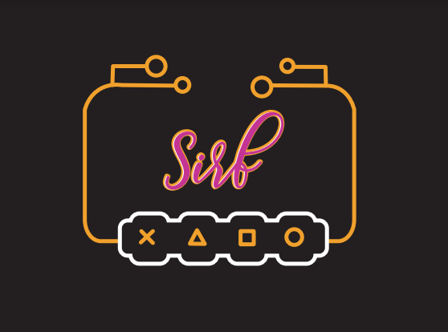
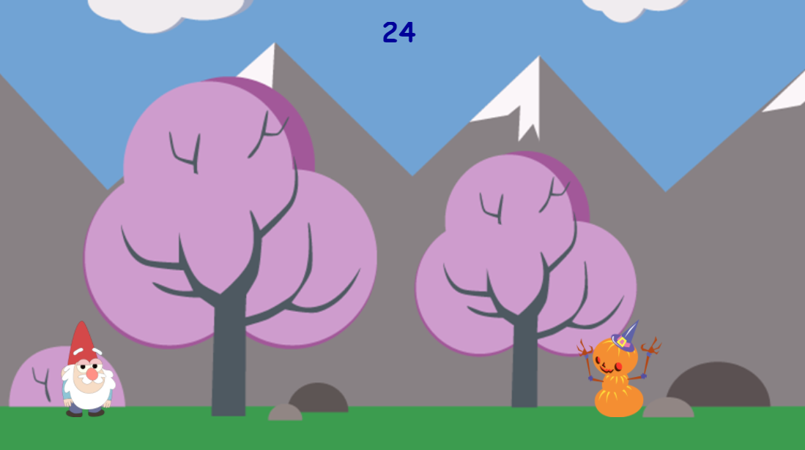
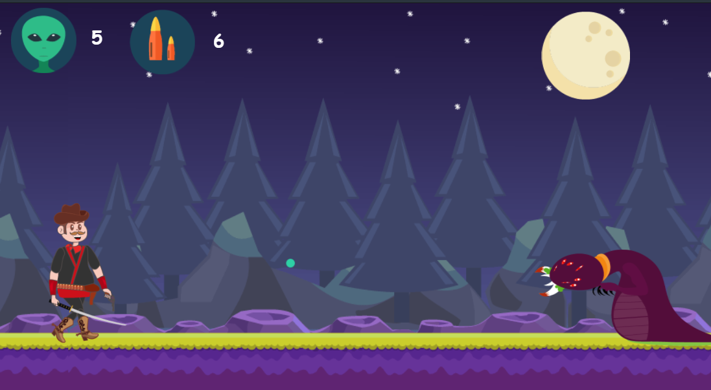
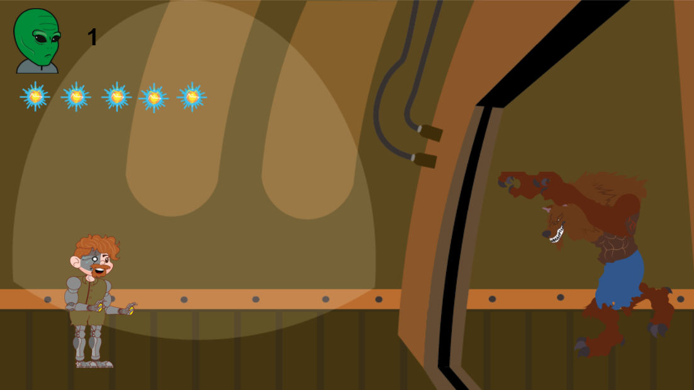
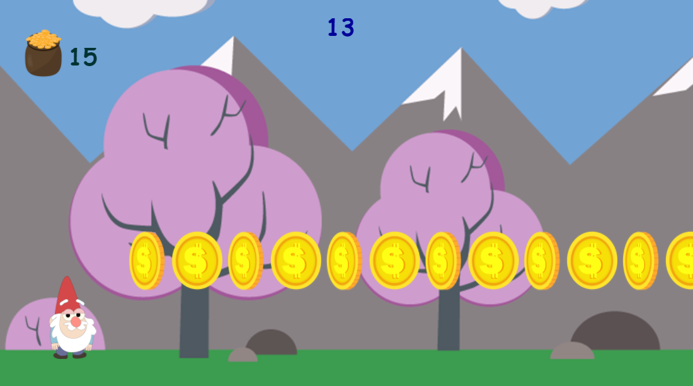

# SISTEMA INTERATIVO PARA A REABILITAÇÃO FISIOTERAPÊUTICA

 

 

O SIRF é um sistema interativo idealizado para ser utilizado como uma das ferramentas aplicadas durante as sessões de fisioterapia. Ele é um equipamento auxiliar e trata-se de um fisiogame controlado pelos sinais musculares do jogador-paciente. Enquanto faz o exercício, o usuário poderá controlar o jogo apenas contraindo e descontraindo o músculo, possibilitando a “gameficação” do tratamento.
 
   
A captação de sinais é feita através de eletrodos, o jogo é carregado no computador e a interface entre o sistema e o computador é feita através de um cabo USB. O objetivo é incentivar o paciente a realizar os exercícios propostos, evitando uma abordagem monótona e cansativa, a fim de contribuir para um melhor desempenho do tratamento.
 
   
Ele é dispositivo portátil e acessível, com um excelente custo-benefício e boa qualidade, que pode ser usado também como uma ferramenta para tratamentos que estão sendo realizados em domicílio. Além disso, SIRF oferece um feedback de cada sessão, para o fisioterapeuta realizar um acompanhamento do desempenho do paciente após os exercícios.

 

# Sistema de Aquisição de Sinais e de Controle

Com relação aos aspectos metodológicos e tecnológicos, para a implementação do código, foi usada a plataforma Arduino, com uso da linguagem de programação C++. Além disso, no primeiro período, foram utilizados o módulo AD8232, a placa Arduino UNO, um relé e uma placa retirada de um mouse, para compor o sistema de aquisição, amplificação, filtragem de sinal e o sistema de controle. Já no segundo período, foram utilizados o Arduino Leonardo e o módulo de aquisição de sinais, eliminando a placa do mouse. 

# Jogos Digitais

Para a programação do jogo, a plataforma Construct 2 foi escolhida e, para a criação das artes e animações, foi usado o programa Adobe Illustrator e o Adobe Animate. Tudo isso foi escolhido com o objetivo de fazer uso das plataformas mais adequadas para, ao final do desenvolvimento, poder oferecer ao jogador-paciente um ambiente virtual atrativo, com o qual ele possa interagir apenas movimentando o músculo, facilitando a realização dos exercícios.

## Categoria Contração
### Subcategoria infantil
#### Jogo
 
 
https://projetosirf.github.io/JOGO-GNOMO-CONTRA/

### Subcategoria adulto
#### Jogo 1
 
 
https://projetosirf.github.io/JOGO1-BORBINHA/

#### Jogo 2
 
 
link

#### Jogo 3
 
 
link

## Categoria Relaxamento

### Subcategoria infantil:
#### Jogo
 
 
link

# Contatos

